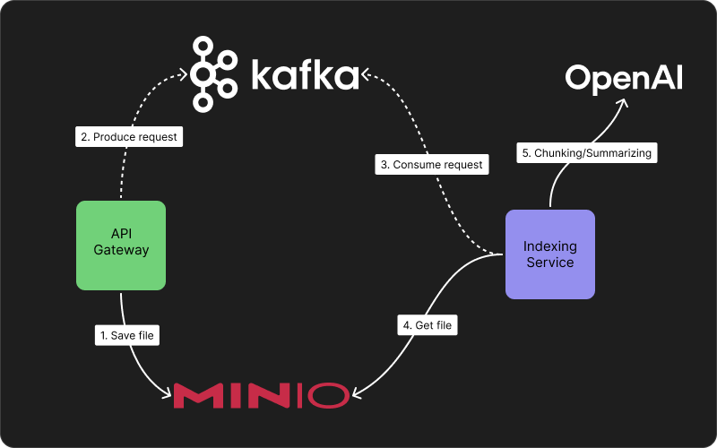
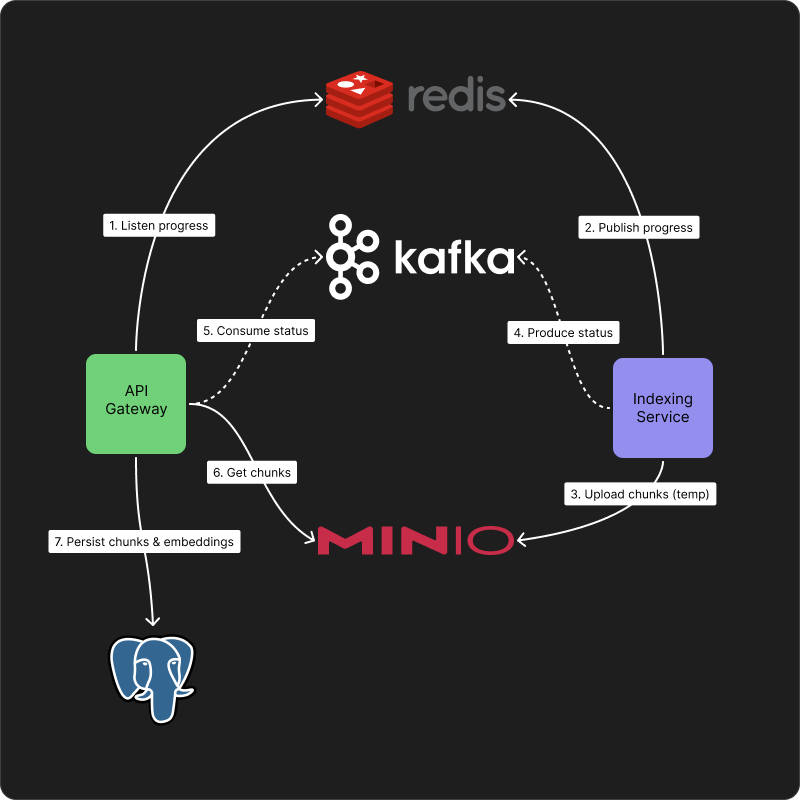
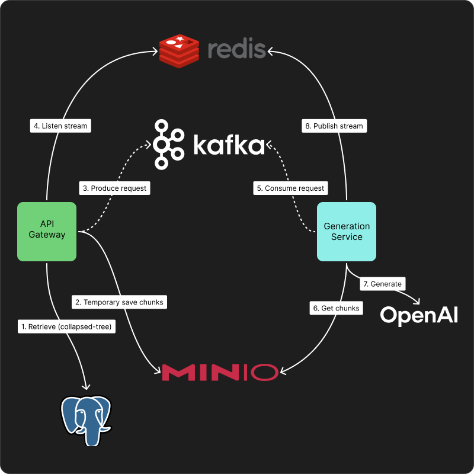

# Primer Chat 📚

> **Chat with your PDFs — fast, grounded, and citation-first.**
> Real-time RAG with **RAPTOR-style** hierarchical indexing, scalable workers, and a minimalist PDF viewer that highlights the exact fragments used.

[](http://109.120.142.57)

- [Primer Chat 📚](#primer-chat-)
  - [Overview](#overview)
  - [Demo](#demo)
  - [Key Features](#key-features)
  - [Quick Start](#quick-start)
  - [How It Works](#how-it-works)
    - [RAPTOR-like Indexing](#raptor-like-indexing)
      - [Indexing Request](#indexing-request)
      - [Indexing Response](#indexing-response)
    - [Question Answering](#question-answering)
  - [Tech Stack](#tech-stack)
  - [Configuration \& Environments](#configuration--environments)
  - [References \& Attribution](#references--attribution)
  - [Contributing](#contributing)
  - [License](#license)

---

## Overview

Primer Chat is a multi-user, production-minded **RAG for PDFs**.
Upload documents, watch **real-time indexing**, and ask questions with **line-level citations** rendered directly in the PDF viewer.

-   **Trustworthy** — every answer cites page/line spans.
-   **Real-time** — streaming indexing + token-by-token responses.
-   **Scalable** — **horizontally scaled workers** for indexing/generation; stateless API.

---

## Demo

-   **GIF (short flow)**
    

> 👉 **[Try Demo](http://109.120.142.57)**

## Key Features

-   ⚡ **Real-time UX**: SSE streaming for answers and indexing events.
-   🧭 **Custom PDF viewer**: highlight overlays, next/prev fragment navigation.
-   🗂️ **Projects/Folders**: attach multiple files to a chat; manage links quickly.
-   🧠 **RAPTOR-style indexing**: hierarchical chunking (leaf→summary→tree) for long-doc QA.
-   🧵 **Infra**: PostgreSQL + **pgvector**, S3/MinIO for files, **Kafka** for queues, **Redis** for live streams/buffers.
-   📈 **Observability-ready**: JSON logs; Vector → Loki → Grafana.

---

## Quick Start

-   **Production-like (full stack: infra + app + logging)**
    ```bash
    make up # build & start everything in detached mode
    ```

*   **Development (infra only), run API/Web locally**

    ```bash
    make up-infra   # start only infra (DB, Redis, Kafka, S3/MinIO, etc.)
    ```

    Then run the **Services** and **Web** locally in dev mode (hot reload):

    ```bash
    # Services
    cd services/...
    uv run -m src.main
    ```

    ```bash
    # Frontend
    cd primer-chat
    npm run dev  # http://localhost:5173
    ```

| Targets                               | Purpose                                 |
| ------------------------------------- | --------------------------------------- |
| `make up`                             | Build & start **infra + app + logging** |
| `make down`                           | Stop full stack & remove orphans        |
| `make ps`                             | List services in the full stack         |
| `make logs service=<name>`            | Tail logs for an app/logging service    |
| `make exec service=<name>`            | Open shell in a container               |
| `make rebuild-service service=<name>` | Rebuild and restart a single service    |
| `make up-infra`                       | Start **infra only** (for local dev)    |
| `make down-infra`                     | Stop infra-only stack                   |
| `make ps-infra`                       | List infra containers                   |
| `make logs-infra service=<name>`      | Tail logs for an infra service          |
| `make postgres-clean`                 | **Remove** Postgres data volume         |

---

## How It Works

### RAPTOR-like Indexing

1. **Parse PDF** (PyMuPDF/fitz, fallbacks for tricky layouts).
2. **Format discovery**: probe top-N text structures; LLM tags headings/lists/tables.
3. **Semantic chunking** with coordinates (page/block/line spans).
4. **Build hierarchy**: embed leaves, cluster bottom-up, **summarize** parents (RAPTOR-style tree).
5. **Persist**: chunks + summaries + embeddings → **Postgres/pgvector**; original → **S3**.
6. **Stream progress**: step events to UI; partial retrieval works before full completion.

#### Indexing Request

<p align="left">
    
</p>

#### Indexing Response

<p align="left">
    
</p>

### Question Answering

1. **Retrieve** coarse→fine via the tree; fetch leaves + parent summaries.
2. **Re-rank** by similarity, structure proximity, and coverage (optionally cross-encoder).
3. **Generate** with **GPT-4o**, emitting inline citations (page\:line).
4. **Render**: viewer highlights fragments; chat streams token-by-token.

<p align="left">
    
</p>

## Tech Stack

-   **Frontend**: React + TypeScript + Vite, shadcn/ui, Tailwind, **Zustand** (persist), custom pdf.js viewer.
-   **Backend**: FastAPI (async), SQLAlchemy (async), **SSE/WebSocket** streaming.
-   **Workers**: Python async; Kafka consumers/producers; RAPTOR-style indexer; batch embedder.
-   **Storage**: PostgreSQL + **pgvector**, S3/MinIO; **Redis** (generation buffers/streams).
-   **Messaging**: **Kafka** (consumer groups for horizontal scale).

---

## Configuration & Environments

Primer Chat separates **secrets** (private, per-env) from **typed config** (public, versioned):

-   **Secrets (`.env`)** → loaded by `shared_config.Secrets` (Pydantic Settings).
-   **Typed config (`config.{env}.yaml`)** → loaded by `shared_config.load_config(env)`, validated by Pydantic models.

> `app_env` controls which YAML is loaded: `config.{app_env}.yaml`.

---

## References & Attribution

-   Parth Sarthi, Salman Abdullah, Aditi Tuli, Shubh Khanna, Anna Goldie, Christopher D. Manning.
    **RAPTOR: Recursive Abstractive Processing for Tree-Organized Retrieval.**
    arXiv:2401.18059, 2024. https://arxiv.org/abs/2401.18059

> We implement a RAPTOR-like pipeline inspired by the paper above. This project is not affiliated with the RAPTOR authors.

## Contributing

PRs and issues welcome. Please keep changes focused and run linters/tests locally.

## License

MIT © Syrenny
